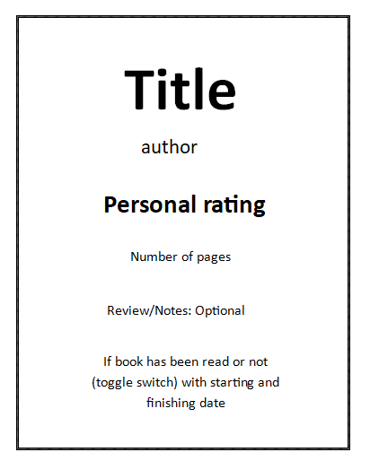

# library

a logbook made with html css and js that allows adding books with their own details

Things I've Learnt:
1. how to add linear gradient for color text

Draft:
1. Additions are layed out with cards
2. Ideal Card Layout:

